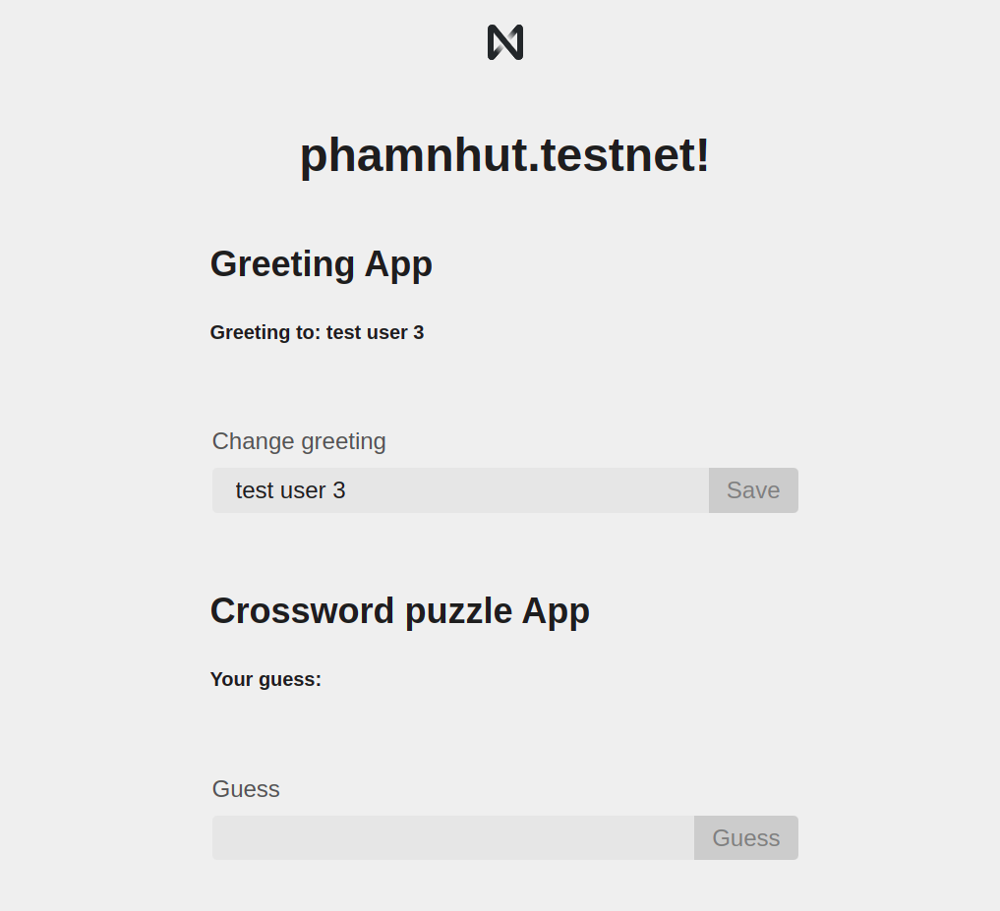

demo_app
==================

Quick Start
===========

Exploring The Code
==================

1. The "backend" code lives in the `/contract` folder. See the README there for
   more info.
2. The frontend code lives in the `/src` folder. `/src/index.html` is a great
   place to start exploring. Note that it loads in `/src/index.js`, where you
   can learn how the frontend connects to the NEAR blockchain.
3. Tests: there are different kinds of tests for the frontend and the smart
   contract. See `contract/README` for info about how it's tested. The frontend
   code gets tested with [jest]. You can run both of these at once with `yarn
   run test`.


Deploy
======

Troubleshooting
===============

On Windows, if you're seeing an error containing `EPERM` it may be related to spaces in your path. Please see [this issue](https://github.com/zkat/npx/issues/209) for more details.


  [React]: https://reactjs.org/
  [create-near-app]: https://github.com/near/create-near-app
  [Node.js]: https://nodejs.org/en/download/package-manager/
  [jest]: https://jestjs.io/
  [NEAR accounts]: https://docs.near.org/docs/concepts/account
  [NEAR Wallet]: https://wallet.testnet.near.org/
  [near-cli]: https://github.com/near/near-cli
  [gh-pages]: https://github.com/tschaub/gh-pages

Near cli
========

```bash
near delete demo_app.phamnhut.testnet phamnhut.testnet
```
```bash
near create-account demo_app.phamnhut.testnet --masterAccount phamnhut.testnet
```
```bash
near deploy demo_app.phamnhut.testnet --initFunction new --initArgs '{"owner_id": "demo_app.phamnhut.testnet"}'
```
```bash
near call demo_app.phamnhut.testnet new_puzzle '{
  "solution": "test01",
  "answers": [
   {
     "num": 1,
     "start": {
       "x": 1,
       "y": 1
     },
     "direction": "Down",
     "length": 5,
     "clue": "NFT market on NEAR that specializes in cards and comics."
   },
   {
     "num": 2,
     "start": {
       "x": 0,
       "y": 2
     },
     "direction": "Across",
     "length": 13,
     "clue": "You can move assets between NEAR and different chains, including Ethereum, by visiting ______.app"
   },
   {
     "num": 3,
     "start": {
       "x": 9,
       "y": 1
     },
     "direction": "Down",
     "length": 8,
     "clue": "NFT market on NEAR with art, physical items, tickets, and more."
   },
   {
     "num": 4,
     "start": {
       "x": 3,
       "y": 8
     },
     "direction": "Across",
     "length": 9,
     "clue": "The smallest denomination of the native token on NEAR."
   },
   {
     "num": 5,
     "start": {
       "x": 5,
       "y": 8
     },
     "direction": "Down",
     "length": 3,
     "clue": "You typically deploy a smart contract with the NEAR ___ tool."
   }
  ]
}' --accountId demo_app.phamnhut.testnet
```
```bash
near call demo_app.phamnhut.testnet submit_solution '{
  "solution": "test",
  "memo": "check memo"
}' --accountId demo_app.phamnhut.testnet
```
ScreenShoot
===========


